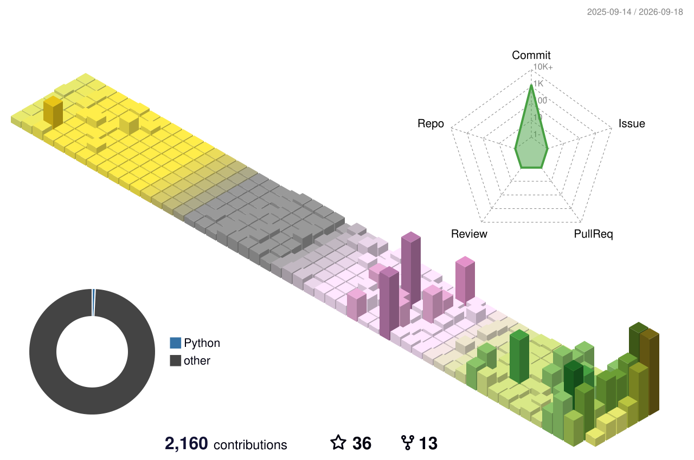

<div align="center">


<a href="https://git.io/typing-svg">
  
</a>

<br />

<a href="https://thuan2172001.github.io/">
  
</a>
<a href="https://www.linkedin.com/in/thuan-trinh-van/">
  
</a>
<a href="https://github.com/thuan2172001?tab=repositories">
  
</a>

</div>

---

## ⚡ About me

```ts
const leo = {
  role: ["Backend & Systems Engineer", "Full-Stack Developer"],
  focus: ["Scalable Systems", "AI Automation", "Cloud", "Developer Tools"],
  enjoys: ["shipping products", "solving hard system problems", "automation"],
  currentlyBuilding: "software that turns complex workflows into simple products",
};
```

I build **production software end-to-end** — backend architecture, APIs, databases, frontend, infrastructure, automation and CI/CD.

My favorite work sits where **systems engineering + AI + product thinking** meet.

> **Build fast. Measure. Improve. Ship.**

## 🎨 What I work with

<div align="center">

### Backend / Systems


### Frontend / Mobile


### Data / Infrastructure


### Workflow


</div>

## 🧩 Selected builds

| | Project | What it is |
|---|---|---|
| 🪄 | **[Dark Magic Agent](https://github.com/thuan2172001/dark-magic-agent)** | Local coding-agent platform, desktop tooling, fleet and developer workflows |
| 📚 | **[Blog / Learning Lab](https://github.com/thuan2172001/blog)** | Learning platform with SRS, gamification, mini-apps and AI-powered workflows |
| 🦀 | **[Rust API Template](https://github.com/zk-steve/rust-web-api-microservice-template)** | Production-oriented Rust REST API / microservice template |
| 🎓 | **[THPT Liên Hà 60 năm](https://60nam.thptlienha.edu.vn/)** | Anniversary and digital yearbook experience for a real school community |

<div align="center">

[](https://thuan2172001.github.io/)

</div>

## 📊 GitHub signal

<div align="center">


<br />


</div>

## 🌈 Contributions, but make it colorful

<div align="center">




</div>

---

<div align="center">

### ✦ Developer → Engineer → Builder ✦

<sub>Backend systems • AI automation • Web products • Cloud infrastructure</sub>


</div>
